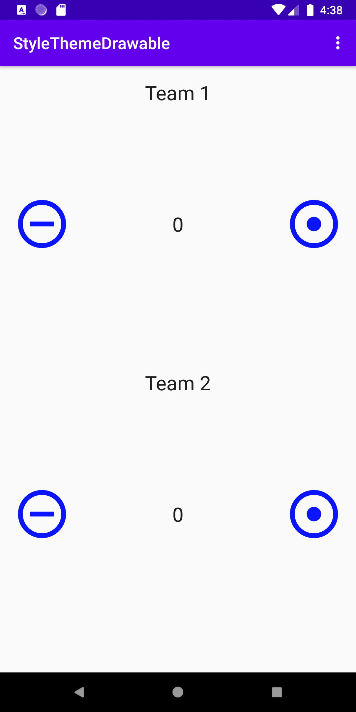
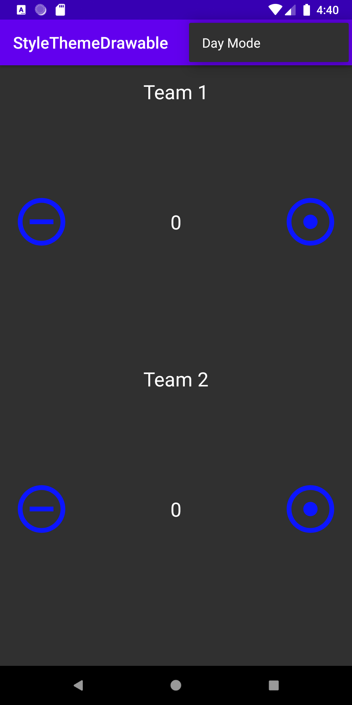

# StyleThemeDrawable
 apply a theme to an Activity or app in XML and programmatically.
  define a style resource.
  Create Drawable resources in XML and use them as backgrounds for your Button elements.
  Add a menu item that changes the theme of the app to a low contrast "night mode.
  
 

